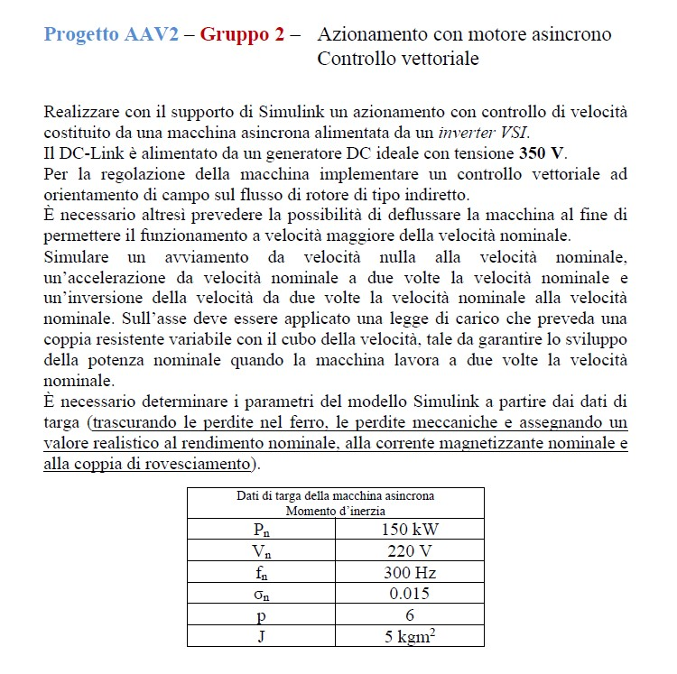

# IndirectFOCControl
This is a project with the goal of simulate an Indirect Field Oriented Control of an induction motor for the exams of Control of Electrical Drives.
The principal target of the assignment is to implement an indirect Field Oriented Control (Hasse) on an induction motor and simulate a given scenario. The motor is powered by a VSI inverter, which is connected to a DC source of 350V.

The motor parameter have been derived from the plate data (we also have neglected iron losses and mechanical losses), in particular the plate look like:

| Name | Value |
| ----------- | ----------- |
| $P_{n}$ | 150 kW |
| $V_{n}$ | 220 V |
| $f_{n}$ | 300Hz |
| $\sigma_{n}$ | 0.015 |
| $p$ | 6 |
| $J$ | 5 kgm^2 |

So the velocity of the rotating magnetic field is $w_{0} = \frac{2\pi f_{n}}{p} =$ 314.16 rad/s.
Also we need to assume other usefull parameter of the machine in order to obtain a complete description of its mathematicaal model:

| Name | Value | Description | Why |
| ----------- | ----------- | ----------- | ----------- |
| $\eta$ | 0.98 | Efficiency | Based on other similar motors |
| $I_{mn}$ | $0.2  \frac{P_{n}}{V_{n}} =$ 136.4 A | Mgnetizing Nominal Current | Repeating pattern in other motors |
| $T_{k}$ | 360 Nm | Max Rated Torque | based on other similar motors |
| $s_{n}$ | 0.02 | Nominal Slip | Range of good motor is [0.02 - 0.05] |
| $I_{n}$ | $\frac{I_{mn}}{0.35} =$ 389.6 A | Nominal Current | Tipically used formula |
| $w_{n}$ | $w_{0}(1-s_{n}) =$ 307.9 rad/s | Nominal Speed | Formula from Nominal Slip|

After we got the values of the equivalent circuit, to simulate propewrly the induction motor:

